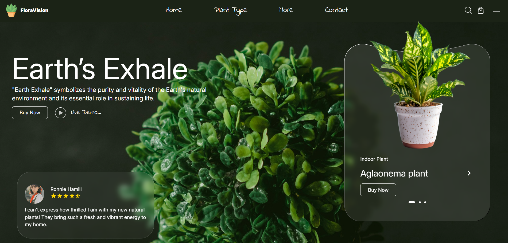
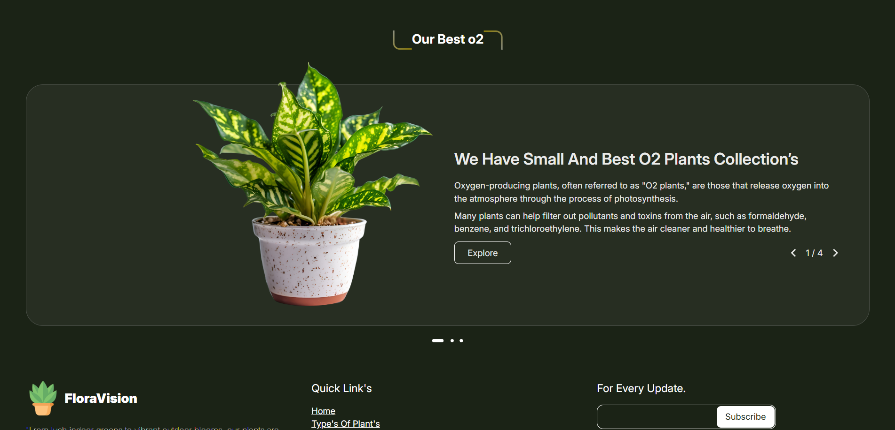
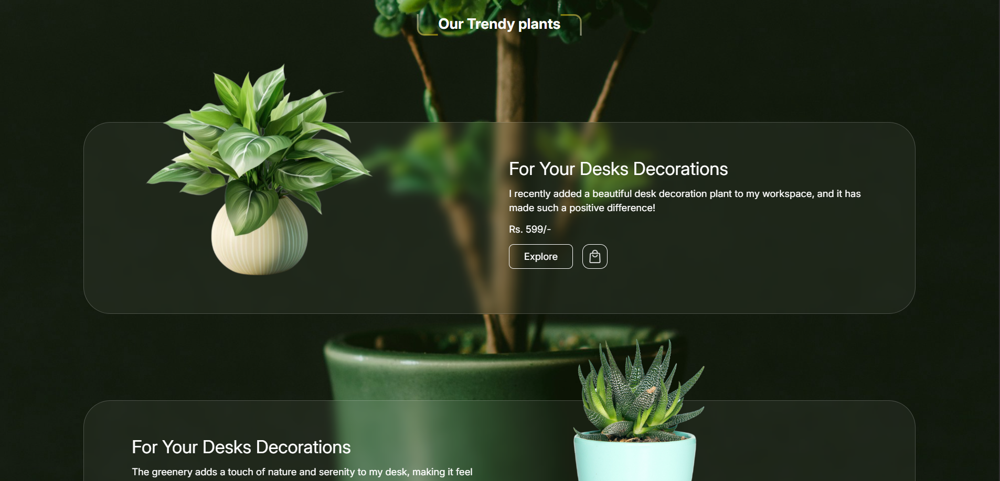

# E-Commerce Plant Store

A modern, responsive e-commerce website for buying natural plants and desk decorations. This project showcases a clean UI with smooth animations and interactive components.

## Features

- **Hero Section**: Eye-catching landing page with background imagery and call-to-action buttons
- **Product Carousel**: Browse through different plant varieties with navigation controls
- **Customer Reviews**: Display user testimonials with star ratings
- **Product Listings**: Showcase trending plants with detailed descriptions
- **Responsive Design**: Fully responsive layout that works on desktop, tablet, and mobile devices
- **Glassmorphism UI**: Modern glass-effect design elements with backdrop blur
- **Interactive Components**: Smooth transitions and hover effects

## Tech Stack

- **React** - Frontend framework
- **Tailwind CSS** - Utility-first CSS framework
- **React Icons** - Icon library for UI elements
- **Vite** - Build tool and development server

## Project Structure

```
e-comm/
├── src/
│   ├── assets/          # Images and static files
│   ├── components/      # React components
│   │   ├── Hero.jsx
│   │   ├── Button.jsx
│   │   ├── CartButton.jsx
│   │   ├── Header.jsx
│   │   ├── Heading.jsx
│   │   └── StarRating.jsx
│   ├── data/           # Product data
│   └── App.jsx         # Main application component
├── public/             # Public assets
└── package.json        # Dependencies
```

## Installation

1. Clone the repository:

```bash
git clone <repository-url>
cd e-comm
```

2. Install dependencies:

```bash
npm install
```

3. Start the development server:

```bash
npm run dev
```

4. Open your browser and navigate to `http://localhost:5173`

## Build

To create a production build:

```bash
npm run build
```

The build files will be generated in the `dist` directory.

## Components

### Hero Component

Main landing section featuring:

- Promotional content
- Product carousel with navigation
- Customer review section
- Trending plant displays

### Button Component

Reusable button with custom styling

### CartButton Component

Shopping cart button for product actions

### StarRating Component

Display star ratings for customer reviews

### Heading Component

Consistent heading styles across the application

## Styling

The project uses Tailwind CSS for styling with custom configurations:

- Glass morphism effects using `backdrop-blur`
- Custom color schemes with opacity
- Responsive breakpoints for mobile, tablet, and desktop
- Custom fonts (Indie Flower)

## Screenshots





## Future Enhancements

- Shopping cart functionality
- Product detail pages
- User authentication
- Payment integration
- Product filtering and search
- Backend API integration

## Author

Himanshu Haldar, 4th Year CSE Student

## License

This project is created for internship assessment purposes.
